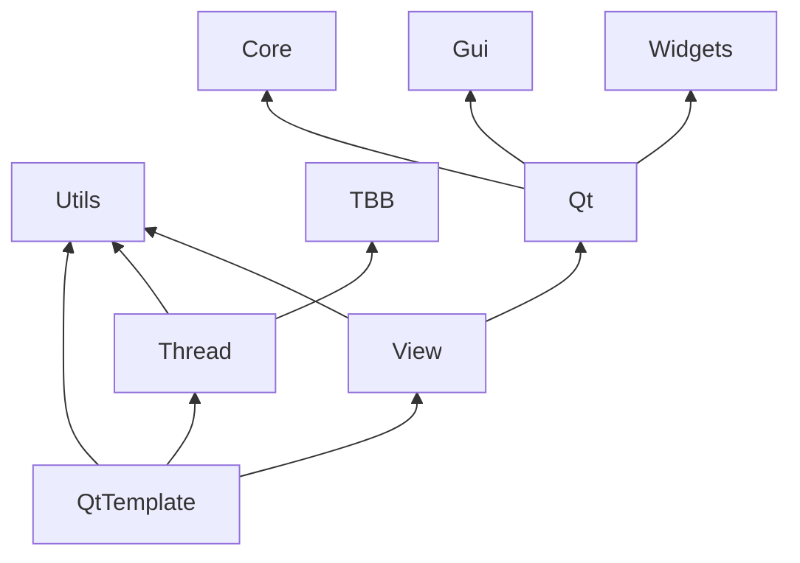

# QtTemplate

Defines a Qt library.

## Layout structure

Provides the same structure found in [ModuleTemplate](https://github.com/chcly/ModuleTemplate) with the addition of extra modules.

+ [Internal/Utils](https://github.com/chcly/Module.Utils) - Provides the project level dependency for Utils.
+ [Internal/View](https://github.com/chcly/Module.View) - Provides the View dependency.

## Testing

The testing directory is setup to work with [googletest](https://github.com/google/googletest).

## Building


```sh
mkdir Build
cmake -S . -B Build -DQtTemplate_BUILD_TEST=ON -DQtTemplate_AUTO_RUN_TEST=ON
cmake --build Build
```

Optional defines.

| Option                      | Description                                          | Default |
|:----------------------------|:-----------------------------------------------------|:-------:|
| QtTemplate_BUILD_TEST         | Build the unit test program.                         |   ON    |
| QtTemplate_AUTO_RUN_TEST      | Automatically run the test program.                  |   OFF   |


### Dependencies

Local and external dependencies.


